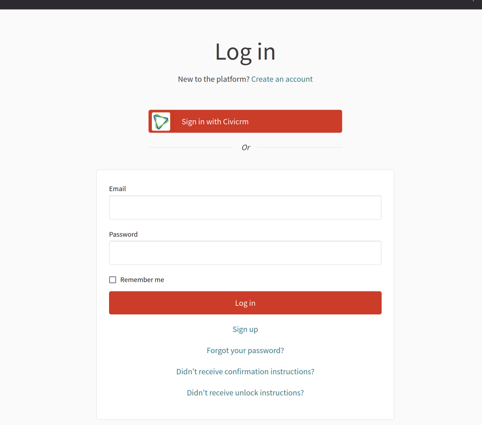

Decidim CiviCRM integration module
==================================

[![[CI] Test](https://github.com/Platoniq/decidim-module-civicrm/actions/workflows/test.yml/badge.svg)](https://github.com/Platoniq/decidim-module-civicrm/actions/workflows/test.yml)
[](https://codeclimate.com/github/Platoniq/decidim-module-civicrm/maintainability)
[](https://codecov.io/gh/Platoniq/decidim-module-civicrm)

This module provides certain integrations in order to use [CiviCRM](https://civicrm.org/) with Decidim.

Currently, the implementation supported is using CiviCRM 5.x with Drupal 7.x.

Features:
--------

- Omniauth integration (aka: "Login with CiviCRM")
- Verification handler for all users logged via Omniauth. Handler: `civicrm`
- Verification handler for every group available in CiviCRM (and intelligent groups). Handler: `groups`
- Contact & groups synchronization to internal Rails models
- Administrator interface to enable which user/groups must be synchronized
- Ability to sincronize users from groups in CiviCRM automatically with private participatory space members
- Ability to redirect users to external url after joining a meeting (admin configurable)

Requirements
------------ 

- The OAuth2 integration requires that Drupal has installed the module https://www.drupal.org/project/oauth2_server. Create a new Oauth Server and then a client with a CLIENT_ID and  CLIENT_SECRET. Add to the callback redirect urls your site: https://YOURDOMAIN.TLD/users/auth/civicrm/callback
- The CiViCRM API integration requires to generate an API key for a user, follow the instructions in https://docs.civicrm.org/sysadmin/en/latest/setup/api-keys/. Use the generated secret for a particular user for the CIVICRM_API_SECRET. Extract from your `civicrm.settings.php` the CIVICRM_SITE_KEY.



Install
-------

Add into the `Gemfile`

```ruby
gem "decidim-civicrm", git: "https://github.com/Platoniq/decidim-module-civicrm", branch: "main"

```

Install dependencies:

```
bundle
```

Install (and run) migrations:


```
bundle exec rails decidim_civicrm:install:migrations
bundle exec rails db:migrate

```

## Configuration

By default, you can just get by using ENV vars to automatically configure the API and the OAuth2 integration.

| ENV | Description | Example |
|---|---|---|
| CIVICRM_API_KEY | You user API key, [see how to generate one here](https://docs.civicrm.org/sysadmin/en/latest/setup/api-keys/).  | `XXXXXXXX` |
| CIVICRM_SITE_KEY | Your CiViCRM installation key. Find it in your `civicrm.setttings.php` | `XXXXXXXX` |
| CIVICRM_API_URL |  The URL for your CiViCRM v3 API. Go to https://YOURCIVICRM.SITE/en/civicrm/api3#explorer, run an example and you'll see the URL there. | `https://YOURCIVICRM.SITE/sites/all/modules/civicrm/extern/rest.php` |
| CIVICRM_CLIENT_ID | In your Drupal, under the OAuth2 module administrator (https://YOURCIVICRM.SITE/en/admin/structure/oauth2-servers), create a new server and a new client. Define the client id and the client secret there | `some_id_you_created` |
| CIVICRM_CLIENT_SECRET | Same as the previous one. | `XXXXXXXX` |
| CIVICRM_SITE | Just the main URL of your Drupal/CiViCRM site | https://YOURCIVICRM.SITE |
| CIVICRM_ICON | **Optional**, defaults to the original CiViCRM logo. If you want to override it, place the image under your `app/packs/images/my-icon.png` and reference it here as `media/images/my-icon.png` | `media/images/civicrm-icon.png` |


### Alternate method

There's more configuration options on this module (see [lib/decidim/civicrm.rb](lib/decidim/civicrm.rb)). 

In order to further customize your integration, you can create an initializer (ie: `config/initializes/decidim_civicrm.rb`) and set some of the variables:

```ruby
# config/initializers/decidim_civicrm.rb

Decidim::Civicrm.configure do |config|
  # Configure api credentials
  config.api =   {
    api_key: Rails.application.secrets.dig(:civicrm, :api, :api_key),
    site_key: Rails.application.secrets.dig(:civicrm, :api, :site_key),
    url: Rails.application.secrets.dig(:civicrm, :api, :url)
  }

  # Configure omniauth secrets
  config.omniauth =   {
    enabled: Rails.application.secrets.dig(:omniauth, :civicrm, :enabled),
    client_id: Rails.application.secrets.dig(:omniauth, :civicrm, :client_id),
    client_secret: Rails.application.secrets.dig(:omniauth, :civicrm, :client_secret),
    icon_path: "media/images/icon.png", # be sure to place the file under app/packs/images/icon.png
    site: Rails.application.secrets.dig(:omniauth, :civicrm, :site)
  }

  # whether to send notifications to user when they auto-verified or not:
  config.send_verification_notifications = false

  # Optional: enable or disable verification methods (all enableD by default)
  config.authorizations = [:civicrm, :civicrm_groups, :civicrm_membership_types]
end

```

> **IMPORTANT**: Remember to activate the verification methods (civicrm, civicrm_groups and civicrm_membership_types) in the Decidim `/system` admin page


## Contributing

Bug reports and pull requests are welcome on GitHub at https://github.com/Platoniq/decidim-module-civicrm.

### Developing

To start contributing to this project, first:

- Install the basic dependencies (such as Ruby and PostgreSQL)
- Clone this repository

Decidim's main repository also provides a Docker configuration file if you
prefer to use Docker instead of installing the dependencies locally on your
machine.

You can create the development app by running the following commands after
cloning this project:

```bash
$ bundle
$ DATABASE_USERNAME=<username> DATABASE_PASSWORD=<password> bundle exec rake development_app
```

Note that the database user has to have rights to create and drop a database in
order to create the dummy test app database.

Then to test how the module works in Decidim, start the development server:

```bash
$ cd development_app
$ DATABASE_USERNAME=<username> DATABASE_PASSWORD=<password> bundle exec rails s
```

In case you are using [rbenv](https://github.com/rbenv/rbenv) and have the
[rbenv-vars](https://github.com/rbenv/rbenv-vars) plugin installed for it, you
can add the environment variables to the root directory of the project in a file
named `.rbenv-vars`. If these are defined for the environment, you can omit
defining these in the commands shown above.

#### Code Styling

Please follow the code styling defined by the different linters that ensure we
are all talking with the same language collaborating on the same project. This
project is set to follow the same rules that Decidim itself follows.

[Rubocop](https://rubocop.readthedocs.io/) linter is used for the Ruby language.

You can run the code styling checks by running the following commands from the
console:

```
$ bundle exec rubocop
```

To ease up following the style guide, you should install the plugin to your
favorite editor, such as:

- Atom - [linter-rubocop](https://atom.io/packages/linter-rubocop)
- Sublime Text - [Sublime RuboCop](https://github.com/pderichs/sublime_rubocop)
- Visual Studio Code - [Rubocop for Visual Studio Code](https://github.com/misogi/vscode-ruby-rubocop)

### Testing

To run the tests run the following in the gem development path:

```bash
$ bundle
$ DATABASE_USERNAME=<username> DATABASE_PASSWORD=<password> bundle exec rake test_app
$ DATABASE_USERNAME=<username> DATABASE_PASSWORD=<password> bundle exec rspec
```

Note that the database user has to have rights to create and drop a database in
order to create the dummy test app database.

In case you are using [rbenv](https://github.com/rbenv/rbenv) and have the
[rbenv-vars](https://github.com/rbenv/rbenv-vars) plugin installed for it, you
can add these environment variables to the root directory of the project in a
file named `.rbenv-vars`. In this case, you can omit defining these in the
commands shown above.

### Test code coverage

If you want to generate the code coverage report for the tests, you can use
the `SIMPLECOV=1` environment variable in the rspec command as follows:

```bash
$ SIMPLECOV=1 bundle exec rspec
```

This will generate a folder named `coverage` in the project root which contains
the code coverage report.

### Localization

If you would like to see this module in your own language, you can help with its
translation at Crowdin:

https://crowdin.com/project/decidim-module-civicrm

## License

See [LICENSE-AGPLv3.txt](LICENSE-AGPLv3.txt).
